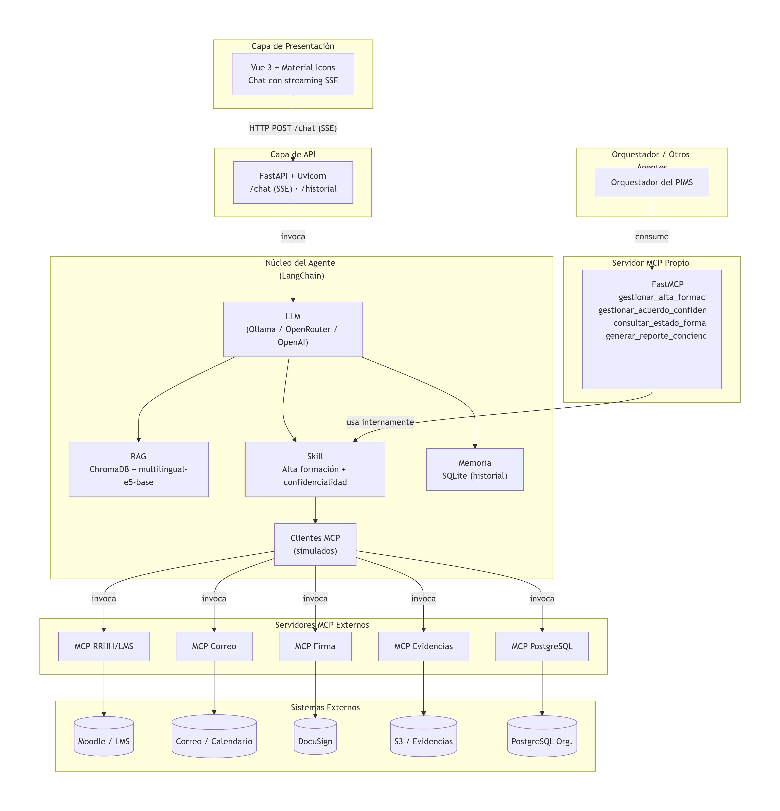

# Agente de Formación y Conciencia


| | |
|---|---|
| **Proyecto** | Sistema Multiagente para PIMS basado en ISO/IEC 27701:2025 |
| **Grupo** | 1 |
| **Agente asignado** | Agente de Formación y Conciencia |
| **Controles cubiertos** | A.3.17 (Concienciación, educación y formación) y A.3.18 (Acuerdos de confidencialidad) |

---

## Índice

1. [Introducción](#1-introducción)
2. [Estado del avance](#2-estado-del-avance)
3. [Arquitectura](#3-arquitectura)
4. [Tecnologías](#4-tecnologías)
5. [Instalación](#5-instalación)
6. [Estructura del proyecto](#6-estructura-del-proyecto)
7. [Componentes técnicos](#7-componentes-técnicos)
8. [Cumplimiento ISO 27701](#8-cumplimiento-iso-27701)
9. [Pruebas](#9-pruebas)
10. [Trabajo futuro](#10-trabajo-futuro)

---

## 1. Introducción

Este documento describe el diseño y la implementación inicial del **Agente de Formación y Conciencia**, una de las piezas del sistema multiagente que implementará un **Privacy Information Management System (PIMS)** basado en ISO/IEC 27701:2025.

El agente actúa como copiloto del DPO para gestionar formación en privacidad, concienciación del personal y acuerdos de confidencialidad. En esta versión de avance, el agente ya es funcional de forma autónoma: consulta una base de conocimiento normativa, ejecuta una Skill de alta de formación, simula acciones sobre sistemas externos mediante MCP y expone sus capacidades a través de un servidor MCP propio.

Es importante aclarar que este es un **avance funcional**, no la versión final. Los MCPs externos están simulados, la integración con el Orquestador aún no se ha realizado, y algunas funcionalidades están planificadas para fases posteriores. El objetivo de esta entrega es demostrar el núcleo del agente, su arquitectura y su potencial de integración.

---

## 2. Estado del avance

Para ser transparente sobre el alcance real de esta entrega, aquí está el detalle de qué está implementado y qué está pendiente.

| Componente | Estado | Detalle |
|------------|--------|---------|
| RAG (Chroma + HuggingFace) | Implementado | Indexa documentos en Markdown/PDF. Búsqueda semántica multilingüe. |
| Skill de alta de formación | Implementado | Función que orquesta RAG, LLM y MCPs. |
| LLM multi-proveedor | Implementado | Ollama, OpenRouter y OpenAI configurables vía `.env`. |
| Streaming SSE | Implementado | Backend envía tokens en tiempo real; frontend los renderiza. |
| UI con Vue 3 + Markdown | Implementado | Chat funcional con renderizado Markdown, sidebar, animaciones. |
| Historial SQLite | Implementado | Persistencia de conversaciones por `thread_id`. |
| Servidor MCP propio | Implementado | Expone 4 herramientas vía FastMCP. |
| Clientes MCP externos | Simulados | Devuelven respuestas ficticias. En producción serán clientes reales. |
| Integración con Orquestador | Pendiente | El servidor MCP funciona, pero no está conectado al PIMS. |
| HITL formal | Parcial | Se pide aprobación en el prompt, sin bloqueo formal. |
| Despliegue en producción | Pendiente | Solo local. Sin Docker, sin autenticación. |

---

## 3. Arquitectura

La arquitectura está diseñada para ser modular y permitir que cada pieza se reemplace sin afectar las demás. En este avance, las capas de presentación, API, núcleo del agente y RAG están implementadas. Los MCPs externos están simulados.



### 3.1 Capas

- **Presentación (Vue 3):** interfaz de chat con sidebar, header y área de mensajes. Consumo del backend mediante `fetch` + `ReadableStream` (SSE). Renderizado de Markdown con `marked` y sanitización con `DOMPurify`. Estilos con Material Design 3 (paleta morada `#6750a4`). Animaciones de typing, transición de mensajes y scroll automático.
- **API (FastAPI):** endpoint `POST /chat` que devuelve `StreamingResponse` con `text/event-stream`. Cada token se envía como evento SSE. Al final, evento `done` con las fuentes recuperadas por el RAG. Endpoint `GET /historial/{thread_id}`. Middleware CORS habilitado.
- **Núcleo (LangChain):** LLM configurable vía `.env`, RAG con Chroma persistente, Skill de alta de formación, memoria SQLite, y clientes MCP (simulados en este avance).
- **Servidores MCP:** externos consumidos (RRHH, Correo, Firma, PostgreSQL, Evidencias) e interno expuesto (FastMCP con 4 herramientas).

### 3.2 Flujo de una petición

1. El DPO escribe: *"Juan Pérez ingresó en Marketing"*.
2. Vue envía `POST /chat` a FastAPI.
3. FastAPI abre un stream SSE y llama al agente.
4. El agente consulta el RAG buscando contexto sobre formación y roles.
5. El agente detecta la intención de "alta de formación" y ejecuta la Skill.
6. La Skill recupera contexto normativo, llama al LLM para generar un plan, simula acciones vía MCPs, y registra la evidencia.
7. FastAPI envía los tokens por SSE conforme se generan.
8. Vue los renderiza en burbujas con Markdown.
9. La conversación queda persistida en SQLite.

---

## 4. Tecnologías

| Capa | Tecnología | Versión | Rol |
|------|------------|---------|-----|
| Lenguaje | Python | 3.10+ | Backend y lógica del agente |
| API | FastAPI | 0.115+ | Endpoints REST y streaming SSE |
| Servidor | Uvicorn | 0.30+ | Servidor ASGI |
| Framework agente | LangChain | 1.4 | Orquestación LLM + tools |
| LLM local | Ollama | latest | Ejecución local de modelos |
| LLM cloud | OpenRouter | API | Modelos en la nube (opcional) |
| LLM cloud | OpenAI | API | Modelos GPT (opcional) |
| Base vectorial | ChromaDB | 1.5 | RAG persistente |
| Embeddings | HuggingFace | multilingual-e5-base | Embeddings multilingües |
| Frontend | Vue 3 | 3.x (CDN) | Interfaz de chat |
| Markdown | marked + DOMPurify | latest | Renderizado seguro de Markdown |
| Iconos | Material Icons | - | Iconografía de la UI |
| Fuente | Inter | - | Tipografía |
| MCP | FastMCP (mcp SDK) | 2.2 | Servidor y clientes MCP |
| Memoria | SQLite | 3 | Historial de conversación |
| Variables de entorno | python-dotenv | 1.x | Configuración |

---

## 5. Instalación

El proyecto incluye un **script de inicialización** que automatiza todo el setup: instalación de dependencias, descarga de modelos, indexación de documentos y levantamiento del backend y frontend.

### 5.1 Requisitos previos

- Python 3.10 o superior (probado con 3.12).
- Ollama instalado (si se usa proveedor local).
- Cuenta en OpenRouter (si se usa proveedor en la nube).
- Navegador moderno (Chrome, Edge, Firefox).

### 5.2 Instalación automática

- **Windows:** ejecutar `setup.bat` desde la raíz del proyecto.
- **Linux / Mac:** ejecutar `setup.sh` desde la raíz del proyecto.

El script hace lo siguiente:

1. Instala las dependencias de `requirements.txt`.
2. Descarga los modelos de Ollama (`qwen2.5:7b` y `nomic-embed-text`).
3. Indexa los documentos de la carpeta `documentos/` en Chroma.
4. Levanta el backend con Uvicorn en el puerto 8000.
5. Levanta el frontend con un servidor HTTP en el puerto 5500.

Al final muestra:

```text
Aplicacion lista.
Frontend: http://localhost:5500
Backend:  http://localhost:8000
MCP:      python backend/mcp_server.py
```

### 5.3 Instalación manual (paso a paso)

Si prefieres hacerlo manualmente:

**1. Crear el entorno virtual**

```bash
python -m venv .venv
```

**2. Activarlo**

```bash
# Windows
.venv\Scripts\activate

# Linux / Mac
source .venv/bin/activate
```

**3. Instalar dependencias**

```bash
pip install -r requirements.txt
pip install langchain-ollama langchain-chroma langchain-huggingface sentence-transformers
```

**4. Descargar modelos de Ollama**

```bash
ollama pull qwen2.5:7b
ollama pull nomic-embed-text
```

**5. Configurar `.env`** (copiar de `.env.example`).

**6. Indexar documentos**

```bash
python -m backend.indexar
```

**7. Levantar el backend**

```bash
uvicorn backend.main:app --host 0.0.0.0 --port 8000
```

**8. Levantar el frontend** (en otra terminal)

```bash
python -m http.server 5500 --directory frontend
```

### 5.4 Configuración del `.env`

```env
LLM_PROVIDER=ollama              # ollama | openrouter | openai
EMBEDDINGS_PROVIDER=huggingface  # ollama | openai | huggingface
MODELO_LLM=qwen2.5:7b
MODELO_EMBEDDINGS=intfloat/multilingual-e5-base
OLLAMA_HOST=http://localhost:11434
OPENAI_API_KEY=
OPENROUTER_API_KEY=
```

---

## 6. Estructura del proyecto

```text
agente-formacion/
├── backend/
│   ├── __init__.py
│   ├── config.py                 # Configuración desde .env
│   ├── main.py                   # FastAPI app + endpoints
│   ├── indexar.py                # Indexación de documentos en Chroma
│   ├── mcp_server.py             # Servidor MCP propio (FastMCP)
│   └── agent/
│       ├── __init__.py
│       ├── llm_factory.py        # Factoría de LLM y embeddings
│       ├── rag.py                # Búsqueda semántica en Chroma
│       ├── skill.py              # Skill: alta de formación
│       ├── mcp_clients.py        # Clientes MCP simulados
│       └── memory.py             # Historial SQLite
├── frontend/
│   ├── index.html                # UI Vue 3 + Material Icons
│   └── app.js                    # Lógica del chat con SSE
├── documentos/                   # Base de conocimiento (PDF / MD)
├── chroma_db/                    # Base vectorial (autogenerada)
├── .env                          # Configuración de proveedores
├── requirements.txt
├── setup.sh
├── setup.bat
└── README.md
```

---

## 7. Componentes técnicos

### 7.1 Factoría multi-proveedor

`backend/agent/llm_factory.py` permite alternar entre **Ollama**, **OpenRouter** y **OpenAI** solo modificando el `.env`. No requiere cambios en el código del agente. Lo mismo aplica para los embeddings (Ollama, OpenAI o HuggingFace).

### 7.2 RAG multilingüe

El RAG funciona en dos fases:

- **Indexación (offline):** los documentos de `documentos/` se dividen en chunks de 500 caracteres con 50 de solapamiento, se convierten a embeddings con `multilingual-e5-base`, y se guardan en Chroma persistente.
- **Consulta (runtime):** la pregunta del usuario se convierte en embedding, se buscan los `k=3` fragmentos más similares, y se inyectan en el prompt del LLM como contexto.

El uso de embeddings multilingües permite que preguntas en español recuperen fragmentos en inglés (como la ISO 27701), resolviendo el problema de idioma cruzado.

### 7.3 Skill de alta de formación

En `backend/agent/skill.py`, la función `ejecutar_skill_alta_formacion()`:

1. Consulta el RAG con `buscar(f"formacion para rol {rol}")`.
2. Construye un prompt para el LLM con el contexto normativo.
3. Genera un plan de formación personalizado.
4. Invoca los MCPs simulados: asignar curso, enviar correo, enviar acuerdo a firma, guardar evidencia.
5. Devuelve un diccionario con el plan y los resultados.

### 7.4 Servidor MCP propio

`backend/mcp_server.py` usa **FastMCP** y expone 4 herramientas al Orquestador u otros agentes:

| Herramienta | Descripción |
|-------------|-------------|
| `gestionar_alta_formacion` | Ejecuta la Skill completa |
| `gestionar_acuerdo_confidencialidad` | Envía un acuerdo a firma |
| `consultar_estado_formacion` | Consulta el estado de formación |
| `generar_reporte_concienciacion` | Genera un reporte de cobertura |

Por defecto usa transporte `stdio`, pero puede configurarse para SSE cambiando `mcp.run(transport="sse")`.

### 7.5 Frontend con streaming SSE

Vue consume el backend con `fetch` + `ReadableStream`, parseando eventos SSE línea por línea. El Markdown se renderiza con `marked` y se sanitiza con `DOMPurify` antes de insertarlo con `v-html`.

---

## 8. Cumplimiento ISO 27701

| Control | Título | Cómo lo cubre el agente |
|---------|--------|--------------------------|
| A.3.17 | Information security awareness, education and training | Detecta necesidades, asigna formación, hace seguimiento, genera reportes |
| A.3.18 | Confidentiality or non-disclosure agreements | Genera, envía, registra y archiva acuerdos de confidencialidad |
| 7.2 | Competence | Evidencia la competencia del personal mediante formación |
| 7.3 | Awareness | Asegura que el personal conoce la política de privacidad |
| 7.4 | Communication | Gestiona comunicaciones internas/externas sobre privacidad |

> **Nota:** la certificación de cumplimiento requiere auditoría formal. Este agente es una herramienta de soporte, no un certificado.

---

## 9. Pruebas

Preguntas que se hicieron al agente y que demuestran su funcionamiento:

| # | Pregunta | Qué demuestra |
|---|----------|---------------|
| 1 | ¿Qué dice el control A.3.17? | RAG lee ISO correctamente |
| 2 | ¿Qué requisitos exige el control A.3.18? | RAG lee ISO correctamente |
| 3 | ¿Qué dicen las cláusulas 7.2, 7.3 y 7.4? | RAG lee ISO correctamente |
| 4 | Juan Pérez ingresó como nuevo empleado en Marketing, ¿qué formación necesita? | La Skill se ejecuta |
| 5 | ¿Puedes asignar el curso de privacidad a Juan Pérez? | HITL pide aprobación |
| 6 | Sí, apruebo. | MCPs simulados ejecutan acciones |
| 7 | Un nuevo proveedor va a acceder a datos personales, ¿qué acuerdo necesita firmar? | Cubre A.3.18 |
| 8 | ¿Quién no ha completado la formación de privacidad? | Usa MCP PostgreSQL |
| 9 | ¿Cuál es el estado de formación de Juan Pérez? | Usa MCP seguimiento |
| 10 | ¿Qué dice ISO 27701 sobre el uso de IA en el tratamiento de datos? | No alucina (no está en docs) |
| 11 | Genera un reporte de concienciación de octubre. | Usa MCP reportes |
| 12 | Envía un recordatorio a los empleados sin formación. | HITL + MCP correo |

---

## 10. Trabajo futuro

- **Reemplazar MCPs simulados por reales:** conectar con Moodle, DocuSign, SMTP, PostgreSQL.
- **Integrar con el Orquestador:** conectar el servidor MCP propio al PIMS.
- **Comunicación con otros agentes:** implementar A2A o mensajes MCP para coordinarse con Inventario, Riesgos, Evidencia.
- **HITL formal:** implementar bloqueo y aprobación explícita.
- **Autenticación y seguridad:** OAuth2, permisos por rol, auditoría.
- **Dockerización:** empaquetar todo para despliegue reproducible.
- **Pruebas automatizadas:** tests unitarios y de integración.

---

## Conclusión

Este avance demuestra que el **Agente de Formación y Conciencia** es funcional en su núcleo: consulta normativa, ejecuta una Skill, simula acciones vía MCP y expone sus capacidades a través de un servidor MCP. La arquitectura es modular y está lista para integrarse en el sistema multiagente completo.

No es un chatbot. Es un agente especializado con RAG, Skill, MCP y UI, diseñado para cubrir controles específicos de ISO 27701:2025. Lo que falta es la integración con el resto del PIMS y el endurecimiento para producción, que se abordarán en la siguiente fase.

---

**Fin del documento de avance.**
